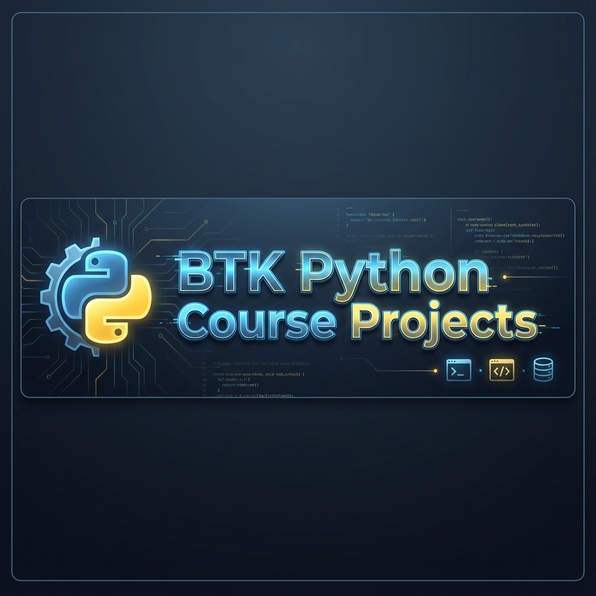

<div align="center">



# 🐍 BTK Akademi - Python Eğitim Projeleri

[](https://www.python.org/)
[](https://www.btkakademi.gov.tr/)
[](LICENSE)
[](https://github.com/bahattinyunus/btk-python-course-projects/graphs/commit-activity)

*Bu depo, BTK Akademi eğitim serüvenimin kodlara dökülmüş halidir.*

[Projeleri Keşfet](#-içerik) • [Nasıl Kullanılır?](#-kurulum) • [İletişim](#-iletişim)

</div>

---

## 🌟 Proje Hakkında

Bu GitHub deposu, **[BTK Akademi](https://www.btkakademi.gov.tr/)** platformunda tamamladığım **"Python ile Programlamaya Giriş"** ve ileri seviye **"Python"** eğitimleri boyunca geliştirdiğim kodları, mini projeleri ve notları içermektedir. 

Sadece bir kod arşivi değil, aynı zamanda Python öğrenme yolculuğumun bir **seyir defteridir**. 🚀

### 🎯 Hedefler
- **Temel Atma:** Python sözdizimi ve temel kavramları pekiştirmek.
- **Pratik Yapma:** Gerçek hayat senaryolarına uygun mini projeler geliştirmek.
- **Portföy:** Öğrenilen bilgileri somut çıktılara dönüştürerek sergilemek.
- **Kaynak Olma:** Python öğrenmeye yeni başlayanlar için temiz ve anlaşılır örnekler sunmak.

---

## 📁 İçerik

Depo içerisinde aşağıdaki başlıklar altında toplanmış örnekler ve projeler bulunmaktadır:

| Konu Başlığı | Açıklama |
| :--- | :--- |
| **📦 Temel Uygulamalar** | Değişkenler, Veri Tipleri, Operatörler |
| **🔄 Kontrol Yapıları** | `if-else`, `for`, `while` döngüleri ile algoritmalar |
| **🧮 Fonksiyonlar** | Modüler kodlama, `lambda`, `map`, `filter` kullanımı |
| **📚 Dosya İşlemleri** | `.txt`, `.csv`, `.json` okuma ve yazma işlemleri |
| **🔎 Hata Yönetimi** | `try-except` blokları ile güvenli kod yazımı |
| **🧠 OOP (NTP)** | Class, Object, Inheritance, Polymorphism kavramları |
| **📊 Veri Bilimi Giriş** | `NumPy` ve `Pandas` ile veri manipülasyonu |
| **� Veri Görselleştirme** | `Matplotlib` ve `Seaborn` ile grafik çizimleri |
| **🌐 Web & API** | Temel API istekleri ve Web scraping örnekleri |

---

## 🚀 Neden Python?

Eğer neden Python seçtiğimi merak ediyorsanız;

> *"Talk is cheap. Show me the code."* – **Linus Torvalds**

Python, sadeliği ve gücü birleştiren mükemmel bir dildir. Veri biliminden web geliştirmeye, yapay zekadan otomasyona kadar sınır tanımaz bir ekosisteme sahiptir.

### ⚡ Öne Çıkan Özellikler
*   **Kolay Okunabilirlik:** İngilizceye yakın, temiz sözdizimi.
*   **Devasa Topluluk:** Karşılaştığınız her hatanın bir çözümü muhtemelen forumlarda var.
*   **Zengin Kütüphaneler:** "Bunun için bir kütüphane var mı?" sorusunun cevabı genellikle "Evet".

---

## 🛠 Kurulum

Bu projeleri kendi bilgisayarınızda çalıştırmak için:

1.  Repo'yu klonlayın:
    ```bash
    git clone https://github.com/bahattinyunus/btk-python-course-projects.git
    ```
2.  Proje dizinine gidin:
    ```bash
    cd btk-python-course-projects
    ```
3.  (Varsa) Gerekli kütüphaneleri yükleyin:
    ```bash
    pip install -r requirements.txt
    ```

---

## 🤝 Katkıda Bulunma

Bu proje açık kaynaklıdır ve her türlü katkıya açıktır! Hata bulursanız veya ekleme yapmak isterseniz lütfen `Pull Request` gönderin.

1.  Bu repoyu **Fork** edin.
2.  Yeni bir **Branch** oluşturun (`git checkout -b ozellik/YeniOzellik`).
3.  Değişikliklerinizi **Commit** edin (`git commit -m 'Yeni özellik eklendi'`).
4.  Branch'inizi **Push** edin (`git push origin ozellik/YeniOzellik`).
5.  Bir **Pull Request** oluşturun.

---

<div align="center">

*Bu proje [BTK Akademi](https://www.btkakademi.gov.tr/) katkılarıyla hazırlanmıştır.* ❤️

[](https://www.linkedin.com/in/bahattinyunus/)
[](https://github.com/bahattinyunus)

</div>
